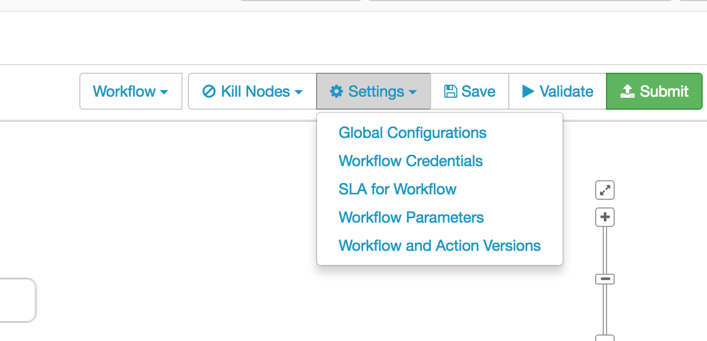
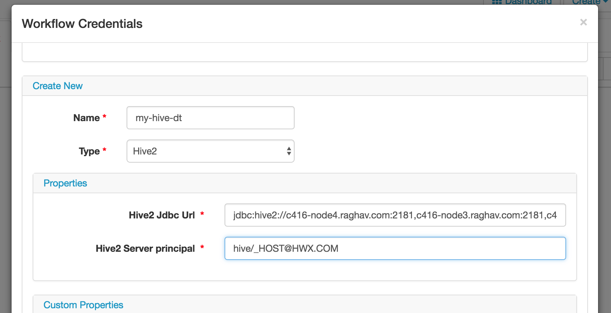

# KERBEROS WORKSHOP

In this workshop we will configure and understand kerberos authentication to use with Hadoop environment. For this workshop configure 2 HDP clusters in Squadron. We will use Ambari servers of both the clusters as KDC and one of the node as KDC client.

 - [LAB 1](#lab-1)

     * Install and configure KDC.
     * Understanding different phases of kerberos authentication with packet trace. 
     

 -  [LAB 2](#lab-2)

      * Understanding the  encryption types. 
      * Configuring the KDC/Client to work with different encryption types.

 - [LAB 3](#lab-3)

 
      * Setup Cross Realm trust in kerberos.
      * Troubleshooting cross relam issues. 

 - [LAB 4](#lab-4)

      * Enable kerberos on HDP cluster with the respective KDC servers
      * Configuring SPNEGO authentication for HDFS/YARN/MR UI and access it from local hosts.
      * Troubleshooting SPNEGO authentication and recreating some common issues. 

 - [LAB 5](#lab-5)

      * Understanding auth_to_local rules and how to  configured in a cross realm environment. 
      * Delegation token concept using oozie to understand how different kind of delegation tokens use while running jobs. 

# **LAB 1:** 

**Understanding Kerberos authentication:** 

  
  **Step 1**. Prepare two hosts with Centos 7 to use as KDC server and a client.
(Can use KDC server from Openstack and on sqadron create a 3 host cluster with Hadoop Services)

  

**Step 2**. On one host install and configure KDC with realm name HWX.COM.

    #yum install krb5-server krb5-libs krb5-workstation
    #vi /etc/krb5.conf 
    [...]
    default_realm=HWX.COM

    [realms]
    HWX.COM {
      kdc=<Hostname>
      admin_server=<Hostname>
    }

    #kdb5_util create -s
    #service krb5kdc start
    #service kadmin start

**Step 3**. Create a user principal and a admin principal.

    #kadmin.local
    kadmin.local: listprincs
    kadmin.local: addprinc user1@HWX.COM
    kadmin.local: addprinc admin/admin@HWX.COM

  

**Step 4**. Review the kdc.conf file and configuration options.

    #cat /var/kerberos/krb5kdc/kdc.conf
    #cat /var/kerberos/krb5kdc/kadm5.acl

[https://web.mit.edu/kerberos/krb5-1.12/doc/admin/conf_files/kdc_conf.html](https://web.mit.edu/kerberos/krb5-1.12/doc/admin/conf_files/kdc_conf.html)
[https://web.mit.edu/kerberos/krb5-1.12/doc/admin/conf_files/kadm5_acl.html](https://web.mit.edu/kerberos/krb5-1.12/doc/admin/conf_files/kadm5_acl.html)

  Configure kdc.conf so that keys can be created with different encryption types (rc4-hmac) like below:

    [realms]
    HWX.COM = {
    master_key_type = aes256-cts
    acl_file = /var/kerberos/krb5kdc/kadm5.acl
    dict_file = /usr/share/dict/words
    admin_keytab = /var/kerberos/krb5kdc/kadm5.keytab
    supported_enctypes = aes256-cts:normal aes128-cts:normal des3-hmac-sha1:normal arcfour-hmac:normal des-hmac-sha1:normal des-cbc-md5:normal des-cbc-crc:normal
    }

  

Review the kadm5.acl, refer documentation for possible acl and the format.

 [https://web.mit.edu/kerberos/krb5-1.12/doc/admin/conf_files/kadm5_acl.html](https://web.mit.edu/kerberos/krb5-1.12/doc/admin/conf_files/kadm5_acl.html)

**Step 5**. On client install the krb5 client pkgs and configured krb5.conf.

    #yum install krb5-libs krb5-workstation
(Update krb5.conf with REALM and kdc info)
    #vi /etc/krb5.conf
    [...]
    default_realm=HWX.COM
    [..]

    [realms]
    
    HWX.COM
    {
     admin_server = <kadmin_server_hostname>
      kdc = <kdc_server_hostname>
    }
  

 **Step 6**. Verify if you can authenticate with the userprincipal user1 created on kdc in **step 3.**

    #kinit user1

  
**Understanding kerberos authentication with packet trace.**

  

**Step 7**. Install tcpdump and wireshark on the client host.

    #yum install -y tcpdump wireshark
        
     

**Step 8**. Start tcpdump in background and collect packet trace for STAGE 1 of kerberos authentication:

    #kdestroy
    #tcpdump -i eth0 -w /var/tmp/krb_phase1.pcap port 88 &
    #kinit user1
    #fg (CTRL+C)

  
**Step 9**. Analyse the tcpdump with wireshark and see the krb5 message being exchanged between client and krb5 server.

    #tshark -r /var/tmp/krb_phase1.pcap
    1 0 172.26.75.225 -> 172.26.85.193 KRB5 231 AS-REQ
    2 0 172.26.85.193 -> 172.26.75.225 KRB5 764 AS-REP

  (For kerberos packet details)

      #tshark -r /var/tmp/krb_phase1.pcap -O kerberos

  **Step 10**. Observe same with kerberos debug enabled on client.

    #export KRB5_TRACE=/var/tmp/krb_phase1.debug.txt
    #kdestroy
    #kinit user1
    #unset KRB5_TRACE

  Examine the debug in /var/tmp/krb_phase1debug.txt

    #cat /var/tmp/krb_phase1.debug.txt

  From the above captured info, understand the first stage of kerberos authentication:

  

**Step 11**.  Enable Pre-Authentication on the principal created observe the change in the AS request/Response.

    kadmin.local: modprinc +requires_preauth user2@HWX.COM
    kadmin.local:  getprinc user2
    Principal: user2@HWX.COM
    Expiration date: [never]
    Last password change: Sun Dec 09 16:40:40 UTC 2018
    Password expiration date: [none]
    Maximum ticket life: 1 day 00:00:00
    Maximum renewable life: 0 days 00:00:00
    Last modified: Sun Dec 09 22:08:17 UTC 2018 (root/admin@HWX.COM)
    Last successful authentication: Sun Dec 09 22:42:37 UTC 2018
    Last failed authentication: [never]
    Failed password attempts: 0
    Number of keys: 4
    Key: vno 1, aes256-cts-hmac-sha1-96, no salt
    Key: vno 1, aes128-cts-hmac-sha1-96, no salt
    Key: vno 1, des3-cbc-sha1, no salt
    Key: vno 1, arcfour-hmac, no salt
    MKey: vno 1
    Attributes: REQUIRES_PRE_AUTH
    Policy: [none]

    #tcpdump -i eth0 -w krb_phase1_2.pcap -s 0 port 88 &
    #kinit user2@HWX.COM
    fg [CTRL+C]
    #tshark -r krb_phase1_2.pcap
    Running as user "root" and group "root". This could be dangerous.
    1 0 172.26.75.225 -> 172.26.85.193 KRB5 230 AS-REQ
    2 0 172.26.85.193 -> 172.26.75.225 KRB5 292 KRB Error: KRB5KDC_ERR_PREAUTH_REQUIRED
    3 1 172.26.75.225 -> 172.26.85.193 KRB5 325 AS-REQ
    4 1 172.26.85.193 -> 172.26.75.225 KRB5 762 AS-REP

  

  **PHASE 2** of kerberos authentication(Requesting service principal)

  Client after AS request, we can request service principal before connecting to a kerberized service. To simulate requesting the service principal we can use the comman kvno. Below steps we create a dummy service principal get a service ticket for that principal

  

**Step 12**.  On kdc login to kadmin prompt and create a dummy service principal:
    
    #kadmin.local
    kadmin.local: addprinc dummy/<hostname>@HWX.COM

  

**Step 13**.  On client make sure you have tgt and use command kvno to request the service ticket while capturing tcpdump.
    

    #klist
    #tcpdump -i eth0 -w /var/tmp/krb_phase2.pcap port 88 &
    #kvno dummy/<hostname>@HWX.COM
    fg [CTRL+C]
    
    #tshark -r /var/tmp/krb_phase2.pcap
    Running as user "root" and group "root". This could be dangerous.
    1 0 172.26.75.225 -> 172.26.85.193 KRB5 993 TGS-REQ
    2 0 172.26.85.193 -> 172.26.75.225 KRB5 963 TGS-REP

  

**PHASE 3** of kerberos authentication deals with the end application where client is supposed to send the request to application with the service ticket received in PHASE 2.

  

To observer PHASE 3 of kerberos, we have to configure a kerberized application and connect to it from client.

  

**Step 14**.  Install httpd service on the third host:
    

    #yum install httpd mod_auth_kerb mod_auth_gssapi

  

**Step 15**.  Configure httpd for kerberos :
    

    #vi /etc/httpd/conf/httpd.conf

  

Append below lines to the end of httpd.conf

    LoadModule auth_kerb_module modules/mod_auth_kerb.so
    <Location /kerberostest>
    AuthType Kerberos
    AuthName "Kerberos Login"
    KrbMethodNegotiate On
    KrbMethodK5Passwd Off
    KrbAuthRealms HWX.COM
    KrbServiceName HTTP
    Krb5KeyTab /etc/httpd/apache.httpd.keytab
    require valid-user
    </Location>

  Create the HTML page to test kerberos authentication: 

    #mkdir -p /var/www/html/kerberostest
    #vim /var/www/html/kerberostest/auth_kerb_page.html
    <html>
    <body>
    <h1>HTTPD kerberos authentication test!!</h1>
    </body>
    </html>

  

**Step 16.**  Create the service principal HTTP/<hostname> on the kdc and create a ketab.
    

    #kadmin.local
    kadmin.local: addprinc HTTP/<hostname>
    kadmin.local: xst -k /tmp/apache.httpd.keytab -norandkey HTTP/<hostname>

(Copy the keytab /tmp/apache.httpd.keytab to the host where httpd is installed under path /etc/httpd/)

  

**Step 17.**  Restart httpd service
    

    #service httpd restart

  

**Step 18.**  Try connecting to the httpd service using curl command:(Make sure you have tgt before execute curl)
    

    #tcpdump -i eth0 -w /var/tmp/krb_phase3.pcap -s 0 port 80
    #curl --negotiate -u : http://sec-lab1.hwx.com:80/kerberostest/auth_kerb_page.html
    #tshark -r /var/tmp/krb_phase3.pcap

  Summarize the kerberos authentication flow as observed from above steps:
  
  
  # LAB 2: 

**Service/User principals, encryption/decryption and Keyatabs :**

In this activity we will create a keytab using dummy user principal and understand how the encryption types effect the kerberos authenticaton flow: 

In LAB 1 we have observed the packet trace in Phase 1, Phase 2 and Phase 3. We can reuse the same packet traces to understand the role of encryption types.

**Step 1:** Execute below command on the tcpdump captured for phase 1: 

    #tshark -r /var/tmp/krb_phase1.pcap -O kerberos 

Here we can observe different fields relates to kerberos client/service principal and encryption types

When client first request for TGT we exchange the info about support encryption types configured in krb5.conf on client. 

        Server Name (Service and Instance): krbtgt/HWX.COM
            Name-type: Service and Instance (2)
            Name: krbtgt
            Name: HWX.COM
        till: 2018-12-10 17:49:56 (UTC)
        rtime: 2018-12-16 17:49:56 (UTC)
        Nonce: 256018256
        Encryption Types: aes256-cts-hmac-sha1-96 aes128-cts-hmac-sha1-96 des-cbc-md5-nt 19 des3-cbc-sha1 rc4-hmac 25 26

Response from the KDC will have service ticket for the kdc itself krbtgt/<REALM> Which shows the two parts(client session key and a ticket for krbtgt)

PART 1: 

      Pvno: 5
        MSG Type: AS-REP (11)
        padata: PA-ENCTYPE-INFO2
            Type: PA-ENCTYPE-INFO2 (19)
                Value: 30073005a003020112 aes256-cts-hmac-sha1-96
                    Encryption type: aes256-cts-hmac-sha1-96 (18)
        Client Realm: HWX.COM
        Client Name (Principal): user2
            Name-type: Principal (1)
            Name: raghav

PART 2: 

    Ticket
        Tkt-vno: 5
        Realm: HWX.COM
        Server Name (Service and Instance): krbtgt/HWX.COM
            Name-type: Service and Instance (2)
            Name: krbtgt
            Name: HWX.COM
        enc-part aes256-cts-hmac-sha1-96
            Encryption type: aes256-cts-hmac-sha1-96 (18)
            Kvno: 1
            enc-part: a29d26347b6fbd9671840af5043edfb997e08e2da137ac9f...
    enc-part aes256-cts-hmac-sha1-96
        Encryption type: aes256-cts-hmac-sha1-96 (18)
        enc-part: d06f49c0855ccaea150a8dae3051ea011ac097e5014485d4...

PART 2 has encrypted part with the type of encryption this can also be seen with "klist -e". Here skey corresponds to the session key of the client i.e., user2 here. and tkt is the encryption time of the ticket received for the service krbtgt. 

    #klist -e
    Ticket cache: FILE:/tmp/krb5cc_0
    Default principal: user2@HWX.COM
    
    Valid starting       Expires              Service principal
    12/09/2018 22:42:37  12/10/2018 22:42:36  krbtgt/HWX.COM@HWX.COM
      renew until 12/09/2018 22:42:37, Etype (skey, tkt): aes256-cts-hmac-sha1-96, aes256-cts-hmac-sha1-96

**Note:** Here ticket is two part, a session key for the service and an authenticator. This ticket is encrypted with the password/key of the service principal so only the key of service principal will be able to decrypt it and retrieve the session key and validate the authentication of client. 

When this ticket is received by the service, service will decrypt it using the keytab configured for it. For service to decrypt the ticket, it should have a keytab with the required key with the same encryption type as that of ticket. Without the proper encryption key in keytab service will not be able to decrypt it and client will not be able to connect to the service. 

Keytabs are nothing but a table with the hashed password using the encryption type defined while creating the keytab. Which we say as long term keys as these keys are valid until their is any change in the password on the account

**Step 2:** Configuration file /etc/krb5.conf is client side config. Configs set in this file are used for requesting the ticket. Configuration includes encryption type/ticket validity. 

Change the krb5.conf to have below properties: 

      ticket_lifetime = 2h
      [..]
      default_tgs_enctypes =  aes des3-cbc-sha1 rc4 des-cbc-md5
      default_tkt_enctypes =  des3-cbc-sha1 rc4 des-cbc-md5

**Step 3:** Capture the tcpdump while requesting for ticket. 

        #tcpdump -i eth0 -w /var/tmp/kinit_stage1_3.pcap -s 0 port 88 &
        #kinit <UserPrincipal>
        #kvno dummy/<hostname> 
        fg[CTRL+C]
        #tshark -r /var/tmp/kinit_stage1_3.pcap -O kerberos

**Step 4:** Review the change in the AS-REQ and the encryption type being requested for user principal and the life time requested. (rtime is 7 days)

        Client Name (Principal): user2
            Name-type: Principal (1)
            Name: user2
        Realm: HWX.COM
        Server Name (Service and Instance): krbtgt/HWX.COM
            Name-type: Service and Instance (2)
            Name: krbtgt
            Name: HWX.COM
        till: 2018-12-10 06:21:27 (UTC)
        rtime: 2018-12-17 04:21:27 (UTC)
        Nonce: 1643455752
        Encryption Types: des3-cbc-sha1 rc4-hmac
            Encryption type: des3-cbc-sha1 (16)
            Encryption type: rc4-hmac (23)

Also review the change in TGS-REQ.

        Realm: HWX.COM
        Server Name (Principal): dummy/sec-lab3.hwx.com
            Name-type: Principal (1)
            Name: dummy
            Name: sec-lab3.hwx.com
        till: 2018-12-10 06:21:27 (UTC)
        Nonce: 1544415690
        Encryption Types: aes256-cts-hmac-sha1-96 aes128-cts-hmac-sha1-96 des-cbc-md5-nt 19 des3-cbc-sha1 rc4-hmac
            Encryption type: aes256-cts-hmac-sha1-96 (18)
            Encryption type: aes128-cts-hmac-sha1-96 (17)
            Encryption type: des-cbc-md5-nt (20)
            Encryption type: Unknown (19)
            Encryption type: des3-cbc-sha1 (16)
            Encryption type: rc4-hmac (23)

Please review the AS/TGS-RESP which also have the encryption type of tkt provided to the client. For the client to be able to connect to server, the keytab on service side should have the same encryption type of the tkt received. 

**Step 5:** In this step we demonstrate common issues with mismatch of encryption type in keytab. Try creating the keytab for the HTTP service principal used in LAB 1 with encryption type rc4-hmac.

On KDC change the password for the principal: 

    kadmin.local:  change_password HTTP/<hostname>

On the client use the ktutil to create the keytab using the password: 

    ktutil:
    :addent -password -p HTTP/<hostname> -kvno 1 -e rc4-hmac 
    password: 
    :wkt /tmp/httpd.kerberos.keytab

 **Step 5.1**: Replace the httpd.keberos.keytab with the /etc/httpd/apache.httpd.keytab and restart httpd service. 

    #cp /tmp/httpd.kerberos.keytab /etc/httpd/apache.httpd.keytab
    #service httpd restart

**Step 5.2:** Try connecting to the service again using curl command: 

    #curl --negotiate -u : http://sec-lab1.hwx.com:80/kerberostest/auth_kerb_page.html
    #klist -e 

**Step 5.3:** Now add the encryption type which client got to the service keytab. 

    ktutil:
    :addent -password -p HTTP/<hostname> -e aes256-cts-hmac-sha1-96
    password: 
    :wkt /etc/httpd/apache.httpd.keytab

**Step 5.4:** Restart the httpd service and verify if the service is accessible now: 

    #service httpd restart
    #curl --negotiate -u : http://sec-lab1.hwx.com:80/kerberostest/auth_kerb_page.html
    #klist -e 

**Step 5.5:** Change the encryption type on the principal in kdc.conf 

    [realms]
     HWX.COM = {
      #master_key_type = aes256-cts
      acl_file = /var/kerberos/krb5kdc/kadm5.acl
      dict_file = /usr/share/dict/words
      admin_keytab = /var/kerberos/krb5kdc/kadm5.keytab
      #supported_enctypes = aes256-cts:normal aes128-cts:normal des3-hmac-sha1:normal arcfour-hmac:normal des-hmac-sha1:normal des-cbc-md5:normal des-cbc-crc:normal
      supported_enctypes = arcfour-hmac:normal des-hmac-sha1:normal des-cbc-md5:normal des-cbc-crc:normal

     }

Restart kdc service: 

    #service krb5kdc restart

Recreate dummy service principal to see the change in the encryption keys. 

    kadmin.local
    kadmin.local:  delprinc dummy/sec-lab3.hwx.com
    kadmin.local:  addprinc dummy/sec-lab3.hwx.com
    kadmin.local:  getprinc dummy/sec-lab3.hwx.com
    Principal: dummy/sec-lab3.hwx.com@HWX.COM
    Expiration date: [never]
    Last password change: Mon Dec 10 18:06:23 UTC 2018
    Password expiration date: [none]
    Maximum ticket life: 1 day 00:00:00
    Maximum renewable life: 0 days 00:00:00
    Last modified: Mon Dec 10 18:06:23 UTC 2018 (root/admin@HWX.COM)
    Last successful authentication: [never]
    Last failed authentication: [never]
    Failed password attempts: 0
    Number of keys: 3
    Key: vno 1, arcfour-hmac, no salt
    Key: vno 1, des-hmac-sha1, no salt
    Key: vno 1, des-cbc-md5, no salt
    MKey: vno 1
    Attributes:
    Policy: [none]

On the client host try getting the service principal for "dummy/sec-lab3.hwx.com" and note the change in the service ticket. 

    [root@sec-lab3 ~]# kdestroy
    [root@sec-lab3 ~]# kinit user2@HWX.COM
    Password for user2@HWX.COM:
    [root@sec-lab3 ~]#
    [root@sec-lab3 ~]#
    [root@sec-lab3 ~]# kvno dummy/sec-lab3.hwx.com@HWX.COM
    dummy/sec-lab3.hwx.com@HWX.COM: kvno = 1
    [root@sec-lab3 ~]# klist -e
    Ticket cache: FILE:/tmp/krb5cc_0
    Default principal: user2@HWX.COM
    
    Valid starting       Expires              Service principal
    12/10/2018 18:07:04  12/10/2018 20:07:02  krbtgt/HWX.COM@HWX.COM
        renew until 12/10/2018 18:07:04, Etype (skey, tkt): des3-cbc-sha1, aes256-cts-hmac-sha1-96
    12/10/2018 18:07:05  12/10/2018 20:07:02  dummy/sec-lab3.hwx.com@HWX.COM
        renew until 12/10/2018 18:07:04, Etype (skey, tkt): arcfour-hmac, arcfour-hmac

**Observations**: 

-->Service ticket encryption type is decided by KDC/TGS and the keytabs created on the hosts should have the required encryption types for it to decrypt and allow clients to access the service. 

-->Client can only request the session key of a particular encryption type based on krb5.conf. 

# LAB 3: 

**Cross Realm trust :** 

Cross realm in kerberos is a way to allow user from one realm to authenticate and connect to the service in the other realm. For this lab we should create another KDC server with a different realm name. 

**Step 1:** Install and configured another KDC server with a different realm name. Something like LABREALM.COM. Follow the same steps(1 and 3) in LAB 1. 

**Step 2:** Create a unique user in the LABREALM.COM to use for our testing. 

    #kadmin.local
    kadmin.local: listprincs
    kadmin.local: addprinc lab-user@LABREALM.COM

Step 3: Configure the client host with the new realm. 

    #vi /etc/krb5.conf 
    [...]
     LABREALM.COM = {
      kdc = <New-KDC-Host>
      admin_server = <New-KDC-Host>
     }

Make sure that you are able to do kinit on the client with LABREALM.COM user. 

    #kinit lab-user@LABREALM.COM

Trust can be created as one-way  or two-way trust. A one-way trust is to allow users to access services from remote realm, so that any user authenticated in REALM1 will be able to access services in REALM2. But REALM2 users cannot access REALM1 services. 

-Trust between the KDC/REALM is established by creating a special principal in both the KDC's with same password/key. 

Principal '**krbtgt/HWX.COM@LABREALM.COM',** this principal would mean the users of LABREALM.COM are allowed to be access services on HWX.COM

**Step 4:** Create the krbtgt principal on both the KDC with the same password. 

    #kadmin.local
    kadmin.local:  addprinc krbtgt/HWX.COM@LABREALM.COM

**Step 5:** Authenticate with the LABREALM.COM user and try accessing the http service running on the HWX.COM realm.

    #export KRB_TRACE=/var/tmp/cross_realm-debug.txt
    #kinit lab-user@LABREALM.COM
    #curl --neogitate -u : http://sec-lab1.hwx.com:80/kerberostest/auth_kerb_page.html
    #unset KRB_TRACE

(make sure that hostname entries of remote KDC is added in the client's /etc/hosts)

Review the debug log /var/tmp/cross_realm-debug.txt. 

# LAB 4: 

Install HDP and enable kerberos : 

**Step 1:** Install HDP cluster and enable kerberos using HWX.COM REALM. Follow the documentation.

https://docs.hortonworks.com/HDPDocuments/Ambari-2.6.2.2/bk_ambari-security/content/running_the_kerberos_wizard.html

**Step 2:** Review the Amabri server logs , find the command being used by ambari to create the principals for services. 

**Step 3 :** Enable spnego authentication on HDFS,YARN and MR UIs. 
https://docs.hortonworks.com/HDPDocuments/Ambari-2.6.2.2/bk_ambari-security/content/configure_ambari_server_for_authenticated_http.html

**Step 4 :** From one of the cluster hosts, submit a MR job by using user created in HWX.COM REALM. 

    #kinit user1@HWX.COM
    #cd /usr/hdp/current/hadoop-mapreduce-client/
    #yarn jar hadoop-mapreduce-examples.jar
    #yarn jar hadoop-mapreduce-examples.jar pi  10 10

Fix any issues faced while running above job. 

**Step 5:** While job is being executed, access the RM UI  and review the job being execute.(You may need to setup your browsers/Laptop to access ).

   **Step 5.1:** Copy the /etc/krb5.conf file from the cluster host to your local laptop. 
   **Step 5.2:** Configure your laptopt to use the new configuration and get the kerberos ticket for the user in HWX.COM Realm. 

          #sudo vi /etc/krb5.conf
          #kinit <user>@HWX.COM
**Step 5.3:** Configure your firefox broswer to set below properties and access the RM UI. 
              In browser URL bar type "about:config" and search for the properties negotiate-urls. Ste the values of this to the domain name of your cluster hosts. 

**Step 6:**  SPNEGO Authentication:
 SPNEGO is a standard to use with web-application access using kerberos tokens. 

   **Step 6.1:** To observe the spnego authentication lets create a simple java code which can be used to access spnego enabled http urls.  Create a JAAS file (will be discussed in next LAB)

         # vi login.conf
             com.sun.security.jgss.krb5.initiate {
             com.sun.security.auth.module.Krb5LoginModule required
             useKeyTab=true keyTab="<userKeyab>" principal="<UserPrincipal>" doNotPrompt=false useTicketCache=false;
             };

 **Step 6.2:** Create a simple java code which can be used to access the http urls

    #vi HttpSpnego.java
    
      import java.io.BufferedReader;
      import java.io.InputStream;
      import java.io.InputStreamReader;
      import java.net.URL;
      
      public class HttpSpnego {
   
          public static void main(String[] args) throws Exception {
              URL url = new URL(args[0]);
              InputStream ins = url.openConnection().getInputStream();
              BufferedReader reader = new BufferedReader(new InputStreamReader(ins));
              String str;
              while((str = reader.readLine()) != null)
                  System.out.println(str);
          }
      }

**Step 7:** Access the spnego enabled url using below command. 

    #<JAVA_HOME>/bin/javac HttpSpnego.java
    #<JAVA_HOME>/bin/java -Dsun.security.krb5.debug=true -Djava.security.krb5.conf=/etc/krb5.conf -Djava.security.auth.login.config=login.conf -Djavax.security.auth.useSubjectCredsOnly=false RunHttpSpnego http://<hostname>:<port>/<pathToAccess>

Review the debug to understand the spnego authentication while accessing the webhdfs url. 

# LAB 5: 

**Kerberos auth_to_local rules and delegation tokens in Hadoop:**

With Kerberos authentication, any user authenticated will be represented with the FQDN name like user1@<Domain>.com which is not a standard posix account and might not exist on the hosts. auth_to_local rules gives us a way to map posix standard usernames to the authenticated principal. 

For example if a user authenticating with the principal user1@lab.com can be mapped to a username like "user1". So anything accessed after authenticating with the principal will be accessed as "user1". 

auth_to_local rules format is something like below: 

    RULE:[1:$1@$0](.*@HWX.COM)s/@.*//
    RULE:[1:$1@$0](hbase-c416@HWX.COM)s/.*/hbase/
    RULE:[2:$1@$0](hive@HWX.COM)s/.*/hive/

A generic format "RULE:[n:string] (regexp)s/pattern/replacement/" 

"n" represents how many components in the principal.For a user principal we have 1 component so n will be set to 1 and for a service princial 2.

   user1@HWX.COM  Can be represented as $1@$0 (REALM is always $0) 

Consider below rule for a user

RULE:[1:$1@$0] (user1@HWX.COM)s/.*/user1/  

 [1:$1@$0] ==> Would define the rule for principal with 1 component, to match this when the principal has $1(firstComponent)@$0(Realm)
(user1@HWX.COM)s/.*/user1/  Once the rule is matched we apply following regex to convert anything to user1.

When a user with principal user1@HWX.COM tries to access the hadoop services, this rule will be evaluated to represent the authenticated principal to posix username "user1"

Similarly we can do the same for service principal. Service principal has two parts "serviceName" and "Hostname" like hive/<c416-node3.hwx.com>@<REALM>. To match the rule for a service principal we should have RULE:[2:$1@$0] which says the rule is for any principal with two parts and rewrite that principal in the format $1==>"serviceName"@$0==>Realm follow by regular expression to convert the rewritten value to get the short ID. 

RULE:[2:$1@$0] (hive@HWX.COM)s/.*/hive/

This rule will represent any service principal of format hive/<hostname>@HWX.COM to "hive". 

**Step 1:**  Kinit with dummy service principal and try uploading a file to hdfs and see what username  the file is created

    #kinit dummy/<hostname>@<REALM>
    #hdfs dfs -put /etc/passwd /tmp
    #hdfs dfs -ls /tmp

**Step 2:** Write the RULE and add in core-site auth_to_local to convert the principal  dummy/<hostname>@<REALM> to "dummy"

**Step 3:** Restart the namenode service and try uploading the file with kinit as dummy service principal. 

    #kinit dummy/<hostname>@<REALM>
    #hdfs dfs -put /var/log/messages /tmp
    #hdfs dfs -ls /tmp

Delegation token concept was introduced to reduce the number of request to KDC server for kerberos authentication. As you have observed we had to get the initial tgt and then service ticket to connect to hdfs, this might not result in huge requests. But if a job is submitted in a kerberized cluster, it might cause issue with KDC being overloaded to serve request for every connection involved in running the job. 

**Step 4:** Get the delegation token from namenode, and access the hdfs without kerberos credentialls

    #kinit <UserPrincipal>
    #hdfs fetchdt --renewer hdfs /var/tmp/dt.token
    #export HADOOP_TOKEN_FILE_LOCATION=/var/tmp/dt.token
    #kdestroy
    #hdfs dfs -ls /

**Step 5:** Enable debug logs and note how delegation token file is used to access hdfs. 

    #export HADOOP_ROOT_LOGGER=DEBUG,console
    #hdfs dfs -ls /

**Step 6:** Submit a yarn job and observe how delegation token is being requested and used further to authenticate and connect to namenode while running the job. 

    #kinit <user>
    #yarn jar hadoop-mapreduce-examples.jar pi  10 10

All the required delegation tokens are obtained when the job start and will be renewed after that until the lifetime. While running the job, we assign a user as renewer to renew token before it gets expired. Usually with jobs being submitted to yarn, renewer is set to "yarn" and yarn user will keep the token renewed until the job completes (which should be before token lifetime). 

# LAB 5.1 : 

   We will use oozie to submit job using delegation token. Here we will use Ambari workflow manager to create oozie workflow and submit a yarn job to access hive. 

   **Step 1:**  Install Oozie and Hive services from Ambari. 
   **Step 2:**  Create a new workflow manager view. 
   **Step 3:**  Access workflow manager and create a hive action:
   
     

  **Step 3.1:** Create new workflow: 
  
    

  **Step 3.2:** Add Hive2 Action to the workflow: 
  
    

   **Step 3.3:** Create credentials, here this defines how Oozie will connect to end services. This credentails will be added to the workflow to request a specific type of delegation token for the service host. 

    

    

   

    

  **Step 3.4:** Add the created credentials to our workflow to use with HS2 authentication. 
  
    

**Step 3.5:** Submit and run the workflow and review the yarn logs of the Oozie job to see what type of delegation tokens are being requested. 

    

